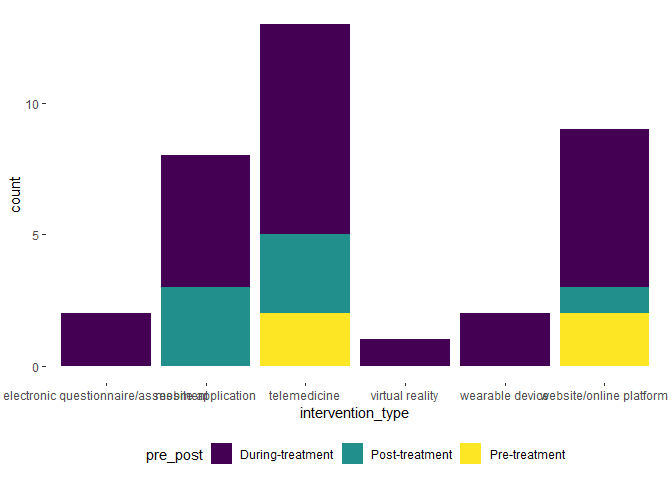
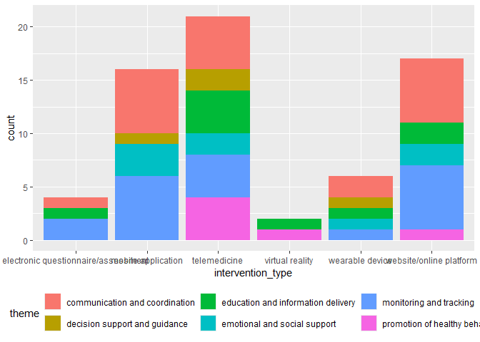

Visualization
================
Polly Wu (rw3031)
2024-11-07

``` r
library(tidyverse)
```

    ## ── Attaching core tidyverse packages ──────────────────────── tidyverse 2.0.0 ──
    ## ✔ dplyr     1.1.4     ✔ readr     2.1.5
    ## ✔ forcats   1.0.0     ✔ stringr   1.5.1
    ## ✔ ggplot2   3.5.1     ✔ tibble    3.2.1
    ## ✔ lubridate 1.9.3     ✔ tidyr     1.3.1
    ## ✔ purrr     1.0.2     
    ## ── Conflicts ────────────────────────────────────────── tidyverse_conflicts() ──
    ## ✖ dplyr::filter() masks stats::filter()
    ## ✖ dplyr::lag()    masks stats::lag()
    ## ℹ Use the conflicted package (<http://conflicted.r-lib.org/>) to force all conflicts to become errors

``` r
library(readxl)
library(ggplot2)
library(rworldmap)
```

    ## Loading required package: sp
    ## ### Welcome to rworldmap ###
    ## For a short introduction type :   vignette('rworldmap')

``` r
data_extract = 
  read_excel("./Data Extraction Sheet.xlsx")|>
  janitor::clean_names()
```

# the plot for year of publication

``` r
year_plot =
data_extract|>
  ggplot(aes(x=year))+geom_histogram( fill = "#08519c")+
  theme_classic()+
  labs(x = "Year of Publication",
       title = "Distribution of Year of Publication")

year_plot
```

    ## `stat_bin()` using `bins = 30`. Pick better value with `binwidth`.

<!-- -->

``` r
ggsave("year_visualization.png", plot = year_plot)
```

    ## Saving 7 x 5 in image
    ## `stat_bin()` using `bins = 30`. Pick better value with `binwidth`.

# the plot for geographic region of publication

``` r
country_count =
data_extract|>
  select(country_region)|>
  mutate(country_region = gsub("10 clinics across ", "", country_region)) |>
  separate_rows(country_region, sep = ", ") |>
  mutate(country_region = trimws(country_region))|>
  mutate(country_region = str_replace(country_region, "Hong Kong/China", "Hong Kong"),
         country_region = str_replace(country_region, "and Sweden", "Sweden"),
         country_region = str_replace(country_region, "US", "United States")
         )|>
  group_by(country_region)|>
  summarise(count=n())
```

``` r
world_map <- joinCountryData2Map(country_count, joinCode = "NAME", nameJoinColumn = "country_region")
```

    ## 17 codes from your data successfully matched countries in the map
    ## 1 codes from your data failed to match with a country code in the map
    ## 226 codes from the map weren't represented in your data

``` r
blue_palette <- rev(c("#08306b", "#08519c", "#2171b5", "#4292c6", "#6baed6", "#9ecae1", "#c6dbef", "#deebf7"))

png("map_visualization.png", width = 800, height = 600)

mapCountryData(world_map, nameColumnToPlot = "count", catMethod = "fixedWidth", colourPalette = blue_palette, mapTitle = "Geographic Distribution regarding Publications")
```

    ## Warning in rwmGetColours(colourPalette, numColours): 8 colours specified and 7
    ## required, using interpolation to calculate colours

``` r
dev.off()
```

    ## png 
    ##   2

# type of interventions

``` r
data_extract|>
  group_by(intervention_type)|>
  summarise(count = n())|>
  arrange(desc(count))
```

    ## # A tibble: 6 × 2
    ##   intervention_type                   count
    ##   <chr>                               <int>
    ## 1 mobile application                      8
    ## 2 telemedicine                            8
    ## 3 website/online platform                 8
    ## 4 electronic questionnaire/assessment     2
    ## 5 wearable device                         2
    ## 6 virtual reality                         1

``` r
data_extract|>
  select(id,intervention_type)|>
  arrange(desc(intervention_type))
```

    ## # A tibble: 29 × 2
    ##       id intervention_type      
    ##    <dbl> <chr>                  
    ##  1     5 website/online platform
    ##  2     6 website/online platform
    ##  3    11 website/online platform
    ##  4    16 website/online platform
    ##  5    17 website/online platform
    ##  6    18 website/online platform
    ##  7    22 website/online platform
    ##  8    24 website/online platform
    ##  9    20 wearable device        
    ## 10    28 wearable device        
    ## # ℹ 19 more rows

## settings

``` r
data_extract|>
  group_by(setting)|>
  summarise(count = n())|>
  arrange(desc(count))
```

    ## # A tibble: 3 × 2
    ##   setting        count
    ##   <chr>          <int>
    ## 1 home-based        23
    ## 2 clinical based     4
    ## 3 both               2

``` r
data_extract|>
  filter(setting == "home-based")
```

    ## # A tibble: 23 × 32
    ##       id title   year objective study_design intervention who_is_delivering_th…¹
    ##    <dbl> <chr>  <dbl> <chr>     <chr>        <chr>        <chr>                 
    ##  1     1 Telem…  2023 We inves… "a parallel… 12-week int… trainer               
    ##  2     2 Testi…  2024 Test the… "Structured… A Lalaby Ap… Research team         
    ##  3     3 Mobil…  2019 determin… "prospectiv… A comprehen… Physician             
    ##  4     4 Co-cr…  2016 To devel… "User-cente… A telehealt… physiotherapists, sur…
    ##  5     5 Why D…  2014 Explore … "Qualitativ… Web-based Q… Physician             
    ##  6     6 Evalu…  2022 Evaluate… "Mixed-meth… Digital pla… oncologists, nurses, …
    ##  7     8 Pilot…  2020 Assess t… "Pilot stud… Telehealth … Physical and occupati…
    ##  8     9 Exper…  2017 Tests ne… "survey, qu… Patients co… Lung cancer nurse spe…
    ##  9    12 Teleh…  2024 To evalu… "Multisite … Early palli… Physician             
    ## 10    14 Impro…  2017 To evalu… "Retrospect… self-report… Physician             
    ## # ℹ 13 more rows
    ## # ℹ abbreviated name: ¹​who_is_delivering_the_intervention
    ## # ℹ 25 more variables: setting <chr>, length_of_interventions <chr>,
    ## #   frequency_of_interventions <chr>,
    ## #   theory_or_non_theory_based_is_it_guided_by_a_specific_framework <chr>,
    ## #   country_region <chr>, patient_demographics <chr>, age_range <chr>,
    ## #   stage_of_cancer <chr>, stage_2 <chr>, …

## stage

``` r
data_extract|>
  select(id,stage_2)|>
  arrange(desc(stage_2))
```

    ## # A tibble: 29 × 2
    ##       id stage_2             
    ##    <dbl> <chr>               
    ##  1     1 local and metastatic
    ##  2     3 local and metastatic
    ##  3     5 local and metastatic
    ##  4     6 local and metastatic
    ##  5     7 local and metastatic
    ##  6    14 local and metastatic
    ##  7    20 local and metastatic
    ##  8    21 local and metastatic
    ##  9    23 local and metastatic
    ## 10    24 local and metastatic
    ## # ℹ 19 more rows

``` r
data_extract|>
  select(id,stage_2)|>
  group_by(stage_2)|>
  summarise(n())
```

    ## # A tibble: 4 × 2
    ##   stage_2                    `n()`
    ##   <chr>                      <int>
    ## 1 Advanced stage, metastatic     8
    ## 2 NA                             8
    ## 3 local                          1
    ## 4 local and metastatic          12

## treatment type

``` r
data_extract|>
  select(treatment_2,id)|>
  separate_rows(treatment_2, sep = ",")|>
  group_by(treatment_2)|>
  summarise(id=paste(unique(id),collapse = ","))
```

    ## # A tibble: 7 × 2
    ##   treatment_2        id                                   
    ##   <chr>              <chr>                                
    ## 1 chemotherapy       1,2,3,5,6,7,9,10,12,14,15,21,23,24,26
    ## 2 immunotherapy      6,7,29                               
    ## 3 not specified      11,13,16,18,19,20,22                 
    ## 4 palliative/hospice 27,28                                
    ## 5 radiotherapy       1,9,14,21,24,25                      
    ## 6 surgery            1,4,5,8,9,14,17,21,24,25             
    ## 7 targeted therapy   7,21

## intervention design \* type

``` r
data_extract|>
  select(id,intervention_type,commercial_tool_designed_specifically_for_the_study)|>
  group_by(intervention_type,commercial_tool_designed_specifically_for_the_study)|>
  summarise(id=paste(unique(id),collapse = ","))|>
  pivot_wider(
    values_from = id,
    names_from = commercial_tool_designed_specifically_for_the_study
  )
```

    ## `summarise()` has grouped output by 'intervention_type'. You can override using
    ## the `.groups` argument.

    ## # A tibble: 6 × 3
    ## # Groups:   intervention_type [6]
    ##   intervention_type                   `designed for the study` `commercial tool`
    ##   <chr>                               <chr>                    <chr>            
    ## 1 electronic questionnaire/assessment 7,13                     <NA>             
    ## 2 mobile application                  2,3,4,14,21,23,27        15               
    ## 3 telemedicine                        1,12,19,26               8,9,25,29        
    ## 4 virtual reality                     <NA>                     10               
    ## 5 wearable device                     28                       20               
    ## 6 website/online platform             6,11,16,17,18,22,24      5

``` r
data_extract|>
  select(id,pre_post,intervention_type)|>
  mutate(
    Pre_treatment = ifelse(str_detect(pre_post, "Pre-treatment"), 1, 0),
    During_treatment = ifelse(str_detect(pre_post, "During-treatment"), 1, 0),
    Post_treatment = ifelse(str_detect(pre_post, "Post-treatment"), 1, 0)
  )|>
  group_by(intervention_type,pre_post)|>
  summarise(count=n())|>
  pivot_wider(
    values_from = count,
    names_from = pre_post
  )
```

    ## `summarise()` has grouped output by 'intervention_type'. You can override using
    ## the `.groups` argument.

    ## # A tibble: 6 × 7
    ## # Groups:   intervention_type [6]
    ##   intervention_type   `During-treatment` `Post-treatment` During-treatment,Pos…¹
    ##   <chr>                            <int>            <int>                  <int>
    ## 1 electronic questio…                  2               NA                     NA
    ## 2 mobile application                   5                3                     NA
    ## 3 telemedicine                         4               NA                      2
    ## 4 virtual reality                      1               NA                     NA
    ## 5 wearable device                      2               NA                     NA
    ## 6 website/online pla…                  5                1                     NA
    ## # ℹ abbreviated name: ¹​`During-treatment,Post-treatment`
    ## # ℹ 3 more variables: `Pre-treatment,During-treatment` <int>,
    ## #   `Pre-treatment,During-treatment,Post-treatment` <int>,
    ## #   `Pre-treatment` <int>

``` r
data_extract|>
  select(id,pre_post,intervention_type)|>
  separate_rows(pre_post, sep = ",")|>
  ggplot(aes(x=intervention_type,fill=pre_post))+geom_bar()+
  theme(legend.position = "bottom")
```

<!-- -->

``` r
data_extract|>
  select(theme,intervention_type)|>
  separate_rows(theme, sep = ",")|>
  ggplot(aes(x=intervention_type,fill=theme))+geom_bar()+
  theme(legend.position = "bottom")
```

<!-- -->

# intervention type over pre_post

``` r
data_extract|>
  select(id,pre_post,intervention_type)|>
  separate_rows(pre_post, sep = ",")|>
  group_by(intervention_type,pre_post)|>
  summarise(count = n())|>
  pivot_wider(
    names_from = pre_post,
    values_from = count
  )|>
  knitr::kable()
```

    ## `summarise()` has grouped output by 'intervention_type'. You can override using
    ## the `.groups` argument.

| intervention_type                   | During-treatment | Post-treatment | Pre-treatment |
|:------------------------------------|-----------------:|---------------:|--------------:|
| electronic questionnaire/assessment |                2 |             NA |            NA |
| mobile application                  |                5 |              3 |            NA |
| telemedicine                        |                8 |              3 |             2 |
| virtual reality                     |                1 |             NA |            NA |
| wearable device                     |                2 |             NA |            NA |
| website/online platform             |                6 |              1 |             2 |

# intervention type over theme

``` r
data_extract|>
  select(theme,intervention_type)|>
  separate_rows(theme, sep = ",")|>
  group_by(intervention_type,theme)|>
  summarise(count = n())|>
  pivot_wider(
    names_from = theme,
    values_from = count
  )|>
  knitr::kable()
```

    ## `summarise()` has grouped output by 'intervention_type'. You can override using
    ## the `.groups` argument.

| intervention_type                   | communication and coordination | education and information delivery | monitoring and tracking | decision support and guidance | emotional and social support | promotion of healthy behavior |
|:------------------------------------|-------------------------------:|-----------------------------------:|------------------------:|------------------------------:|-----------------------------:|------------------------------:|
| electronic questionnaire/assessment |                              1 |                                  1 |                       2 |                            NA |                           NA |                            NA |
| mobile application                  |                              6 |                                 NA |                       6 |                             1 |                            3 |                            NA |
| telemedicine                        |                              5 |                                  4 |                       4 |                             2 |                            2 |                             4 |
| virtual reality                     |                             NA |                                  1 |                      NA |                            NA |                           NA |                             1 |
| wearable device                     |                              2 |                                  1 |                       1 |                             1 |                            1 |                            NA |
| website/online platform             |                              6 |                                  2 |                       6 |                            NA |                            2 |                             1 |

``` r
data_extract|>
  select(theme,intervention_type, pre_post)|>
  separate_rows(theme, sep = ",")|>
  group_by(intervention_type,theme,pre_post)|>
  summarise(count = n())|>
  pivot_wider(
    names_from = pre_post,
    values_from = count
  )|>
  knitr::kable()
```

    ## `summarise()` has grouped output by 'intervention_type', 'theme'. You can
    ## override using the `.groups` argument.

| intervention_type                   | theme                              | During-treatment | Post-treatment | During-treatment,Post-treatment | Pre-treatment,During-treatment | Pre-treatment,During-treatment,Post-treatment | Pre-treatment |
|:------------------------------------|:-----------------------------------|-----------------:|---------------:|--------------------------------:|-------------------------------:|----------------------------------------------:|--------------:|
| electronic questionnaire/assessment | communication and coordination     |                1 |             NA |                              NA |                             NA |                                            NA |            NA |
| electronic questionnaire/assessment | education and information delivery |                1 |             NA |                              NA |                             NA |                                            NA |            NA |
| electronic questionnaire/assessment | monitoring and tracking            |                2 |             NA |                              NA |                             NA |                                            NA |            NA |
| mobile application                  | communication and coordination     |                4 |              2 |                              NA |                             NA |                                            NA |            NA |
| mobile application                  | decision support and guidance      |               NA |              1 |                              NA |                             NA |                                            NA |            NA |
| mobile application                  | emotional and social support       |               NA |              3 |                              NA |                             NA |                                            NA |            NA |
| mobile application                  | monitoring and tracking            |                4 |              2 |                              NA |                             NA |                                            NA |            NA |
| telemedicine                        | communication and coordination     |                3 |             NA |                               1 |                              1 |                                            NA |            NA |
| telemedicine                        | decision support and guidance      |                1 |             NA |                              NA |                             NA |                                             1 |            NA |
| telemedicine                        | education and information delivery |                1 |             NA |                               2 |                             NA |                                             1 |            NA |
| telemedicine                        | emotional and social support       |               NA |             NA |                               2 |                             NA |                                            NA |            NA |
| telemedicine                        | monitoring and tracking            |                3 |             NA |                              NA |                              1 |                                            NA |            NA |
| telemedicine                        | promotion of healthy behavior      |                2 |             NA |                               2 |                             NA |                                            NA |            NA |
| virtual reality                     | education and information delivery |                1 |             NA |                              NA |                             NA |                                            NA |            NA |
| virtual reality                     | promotion of healthy behavior      |                1 |             NA |                              NA |                             NA |                                            NA |            NA |
| wearable device                     | communication and coordination     |                2 |             NA |                              NA |                             NA |                                            NA |            NA |
| wearable device                     | decision support and guidance      |                1 |             NA |                              NA |                             NA |                                            NA |            NA |
| wearable device                     | education and information delivery |                1 |             NA |                              NA |                             NA |                                            NA |            NA |
| wearable device                     | emotional and social support       |                1 |             NA |                              NA |                             NA |                                            NA |            NA |
| wearable device                     | monitoring and tracking            |                1 |             NA |                              NA |                             NA |                                            NA |            NA |
| website/online platform             | communication and coordination     |                4 |              1 |                              NA |                             NA |                                            NA |             1 |
| website/online platform             | education and information delivery |                1 |             NA |                              NA |                             NA |                                            NA |             1 |
| website/online platform             | emotional and social support       |                1 |             NA |                              NA |                             NA |                                            NA |             1 |
| website/online platform             | monitoring and tracking            |                4 |              1 |                              NA |                              1 |                                            NA |            NA |
| website/online platform             | promotion of healthy behavior      |               NA |             NA |                              NA |                              1 |                                            NA |            NA |

``` r
data_extract|>
  select(id, theme,intervention_type, pre_post)|>
  separate_rows(theme, sep = ",")|>
  group_by(intervention_type,theme,pre_post)|>
  summarise(ids = paste(unique(id), collapse = ", ")) |>
  pivot_wider(
    names_from = pre_post,
    values_from = ids
  )|>
  knitr::kable()
```

    ## `summarise()` has grouped output by 'intervention_type', 'theme'. You can
    ## override using the `.groups` argument.

| intervention_type                   | theme                              | During-treatment | Post-treatment | During-treatment,Post-treatment | Pre-treatment,During-treatment | Pre-treatment,During-treatment,Post-treatment | Pre-treatment |
|:------------------------------------|:-----------------------------------|:-----------------|:---------------|:--------------------------------|:-------------------------------|:----------------------------------------------|:--------------|
| electronic questionnaire/assessment | communication and coordination     | 13               | NA             | NA                              | NA                             | NA                                            | NA            |
| electronic questionnaire/assessment | education and information delivery | 7                | NA             | NA                              | NA                             | NA                                            | NA            |
| electronic questionnaire/assessment | monitoring and tracking            | 7, 13            | NA             | NA                              | NA                             | NA                                            | NA            |
| mobile application                  | communication and coordination     | 2, 3, 23, 27     | 4, 14          | NA                              | NA                             | NA                                            | NA            |
| mobile application                  | decision support and guidance      | NA               | 14             | NA                              | NA                             | NA                                            | NA            |
| mobile application                  | emotional and social support       | NA               | 4, 14, 21      | NA                              | NA                             | NA                                            | NA            |
| mobile application                  | monitoring and tracking            | 2, 3, 15, 23     | 4, 14          | NA                              | NA                             | NA                                            | NA            |
| telemedicine                        | communication and coordination     | 12, 19, 26       | NA             | 9                               | 25                             | NA                                            | NA            |
| telemedicine                        | decision support and guidance      | 12               | NA             | NA                              | NA                             | 8                                             | NA            |
| telemedicine                        | education and information delivery | 19               | NA             | 1, 9                            | NA                             | 8                                             | NA            |
| telemedicine                        | emotional and social support       | NA               | NA             | 1, 9                            | NA                             | NA                                            | NA            |
| telemedicine                        | monitoring and tracking            | 12, 26, 29       | NA             | NA                              | 25                             | NA                                            | NA            |
| telemedicine                        | promotion of healthy behavior      | 19, 29           | NA             | 1, 9                            | NA                             | NA                                            | NA            |
| virtual reality                     | education and information delivery | 10               | NA             | NA                              | NA                             | NA                                            | NA            |
| virtual reality                     | promotion of healthy behavior      | 10               | NA             | NA                              | NA                             | NA                                            | NA            |
| wearable device                     | communication and coordination     | 20, 28           | NA             | NA                              | NA                             | NA                                            | NA            |
| wearable device                     | decision support and guidance      | 28               | NA             | NA                              | NA                             | NA                                            | NA            |
| wearable device                     | education and information delivery | 28               | NA             | NA                              | NA                             | NA                                            | NA            |
| wearable device                     | emotional and social support       | 20               | NA             | NA                              | NA                             | NA                                            | NA            |
| wearable device                     | monitoring and tracking            | 28               | NA             | NA                              | NA                             | NA                                            | NA            |
| website/online platform             | communication and coordination     | 6, 18, 22, 24    | 17             | NA                              | NA                             | NA                                            | 16            |
| website/online platform             | education and information delivery | 22               | NA             | NA                              | NA                             | NA                                            | 16            |
| website/online platform             | emotional and social support       | 18               | NA             | NA                              | NA                             | NA                                            | 16            |
| website/online platform             | monitoring and tracking            | 6, 11, 18, 24    | 17             | NA                              | 5                              | NA                                            | NA            |
| website/online platform             | promotion of healthy behavior      | NA               | NA             | NA                              | 5                              | NA                                            | NA            |

# pre_treatment support

``` r
data_extract|>
  filter(str_detect(pre_post, regex("pre-treatment", ignore_case = TRUE)))|>
  select(id, pre_post,impact_of_technology_on_treatment_outcomes)|>
  group_by(pre_post)|>
  knitr::kable()
```

|  id | pre_post                                      | impact_of_technology_on_treatment_outcomes                                                                                                                                                                                                            |
|----:|:----------------------------------------------|:------------------------------------------------------------------------------------------------------------------------------------------------------------------------------------------------------------------------------------------------------|
|   5 | Pre-treatment,During-treatment                | Improved decision-making, emotional support, reduced anxiety.                                                                                                                                                                                         |
|   8 | Pre-treatment,During-treatment,Post-treatment | High adherence to the program; improved functional capacity, improving trajectory for patient distress                                                                                                                                                |
|  16 | Pre-treatment                                 | Website improved patient understanding of SABR and helped reduce anxiety based on the qualitative outcome                                                                                                                                             |
|  25 | Pre-treatment,During-treatment                | Time to treatment initiation did not differ between telemedicine and in-person visits across all treatment modalities, for patients who are newly diagnosied the median time from referral to initial visit were shorter among the telemedicine group |

# during treatment

``` r
data_extract|>
  filter(str_detect(pre_post, regex("during-treatment", ignore_case = TRUE)))|>
  select(id, pre_post,impact_of_technology_on_treatment_outcomes)|>
  group_by(pre_post)|>
  knitr::kable()
```

|  id | pre_post                                      | impact_of_technology_on_treatment_outcomes                                                                                                                                                                                                                                                                 |
|----:|:----------------------------------------------|:-----------------------------------------------------------------------------------------------------------------------------------------------------------------------------------------------------------------------------------------------------------------------------------------------------------|
|   1 | During-treatment,Post-treatment               | intervention participants had statistically significant and clinically meaningful improved HRQL (SGRQ total, symptom, and impact scores) (standardized effect size: -1.03 to -1.30).                                                                                                                       |
|   2 | During-treatment                              | report of relevant symptoms after chemotherapy                                                                                                                                                                                                                                                             |
|   3 | During-treatment                              | improvement in excersice capacity, decrease pain severity at 6 weeks, improve in anxiety and depression at 12 week, no change on QoL, reduction in unexpected visit to ED                                                                                                                                  |
|   5 | Pre-treatment,During-treatment                | Improved decision-making, emotional support, reduced anxiety.                                                                                                                                                                                                                                              |
|   6 | During-treatment                              | Improved communication, enhanced engagement, better psychosocial needs identification, easier planning of care activites, high reponse rate for patients during follow up                                                                                                                                  |
|   7 | During-treatment                              | 90.9% compliance rate for lung cancer patients, enhanced communication, symptom management, and care adjustments.                                                                                                                                                                                          |
|   8 | Pre-treatment,During-treatment,Post-treatment | High adherence to the program; improved functional capacity, improving trajectory for patient distress                                                                                                                                                                                                     |
|   9 | During-treatment,Post-treatment               | Improved identification of patient needs and patient report improved quality of life at follow up assessment, emotional support, 75% reduction in high concerns                                                                                                                                            |
|  10 | During-treatment                              | patients had an altered perception of time, no signficant difference in symptom distress, no cybersickness                                                                                                                                                                                                 |
|  11 | During-treatment                              | Reduced symptom distress in CHESS arm versus Internet arm at 4 and 6 months, with possible survival benefit for CHESS users                                                                                                                                                                                |
|  12 | During-treatment                              | Telehealth visits were found equivalent to in-person care in maintaining quality of life, no difference in satisfaction with care, anxiety and depression symptoms, use of approach-oriented or avoidant coping strategies, or perceptions of the primary goal of treatment and curability of their cancer |
|  13 | During-treatment                              | Improved patient awareness of symptoms and facilitated communication with healthcare providers; advantages of electronic assessment mentioned in interview: clear presentation, expedited assessment, user-friendliness                                                                                    |
|  15 | During-treatment                              | Improved QoL at week 12, but not week 6 or week 18, improved patient-HCP communication                                                                                                                                                                                                                     |
|  18 | During-treatment                              | High potential for supporting self-management of chronic breathlessness if implemented, though outcomes not directly measured                                                                                                                                                                              |
|  19 | During-treatment                              | patients reported symptom relief, lifestyle improvements, improved self efficacy                                                                                                                                                                                                                           |
|  20 | During-treatment                              | Degree of physical activity is correlated with patient reported outcome (brief fatigue inventory, MD Anderson Symptom Inventory)                                                                                                                                                                           |
|  22 | During-treatment                              | Patients in the CHESS+CR group had improved symptoms reported more often than those in CHESS-only (53% vs. 26%), web-based reporting let to more timely symptom management                                                                                                                                 |
|  23 | During-treatment                              | SCH participants had lower symptom severity, fewer severe/moderate symptom days, and more mild/no symptom days compared to UC.                                                                                                                                                                             |
|  24 | During-treatment                              | 61% (17/28) reported that this information enhanced knowledge of their disease and 43% (12/28) indicated that it enhanced their sense of control over their disease, no improvement of patient outcome over time                                                                                           |
|  25 | Pre-treatment,During-treatment                | Time to treatment initiation did not differ between telemedicine and in-person visits across all treatment modalities, for patients who are newly diagnosied the median time from referral to initial visit were shorter among the telemedicine group                                                      |
|  26 | During-treatment                              | Older adults reported greater increase in HRQOL than younger adults, the increase are statistically signficant when comparing baseline with 6 months                                                                                                                                                       |
|  27 | During-treatment                              | Reduction in reported symptom severity in the SCH group compared to the control group, days reporting one or more moderate-to-severe patient symptom reduce by 38%                                                                                                                                         |
|  28 | During-treatment                              | Higher activity (angle and spin values) correlated with survival, wearable device successfully evaluate prognosis of patients and predict survival outcomes for patients in hospice care                                                                                                                   |
|  29 | During-treatment                              | A signifcant 2.1 point decrease in fatigue level comparing pre- and post programme scores. Patients show increase in moderate physical acvtivity time, and intrinsic motivation to practice PA                                                                                                             |

# post_treatment

``` r
data_extract|>
  filter(str_detect(pre_post, regex("post-treatment", ignore_case = TRUE)))|>
  select(id, pre_post,impact_of_technology_on_treatment_outcomes)|>
  group_by(pre_post)|>
  knitr::kable()
```

|  id | pre_post                                      | impact_of_technology_on_treatment_outcomes                                                                                                                                           |
|----:|:----------------------------------------------|:-------------------------------------------------------------------------------------------------------------------------------------------------------------------------------------|
|   1 | During-treatment,Post-treatment               | intervention participants had statistically significant and clinically meaningful improved HRQL (SGRQ total, symptom, and impact scores) (standardized effect size: -1.03 to -1.30). |
|   4 | Post-treatment                                | Positive intentions from HCPs and patients to use the application; improved confidence in recovery and reduced insecurity about symptoms and rehabilitation progress.                |
|   8 | Pre-treatment,During-treatment,Post-treatment | High adherence to the program; improved functional capacity, improving trajectory for patient distress                                                                               |
|   9 | During-treatment,Post-treatment               | Improved identification of patient needs and patient report improved quality of life at follow up assessment, emotional support, 75% reduction in high concerns                      |
|  14 | Post-treatment                                | Significant improvement in survival with median survival of 22.4 months in the experimental group versus 16.7 months in the control group                                            |
|  17 | Post-treatment                                | Improved quality of life (SF-36 scores) and high patient satisfaction in the remote group compared to conventional care group                                                        |
|  21 | Post-treatment                                | Improved overall survival and better performance status at relapse in the intervention group, reduced imaging needs                                                                  |
